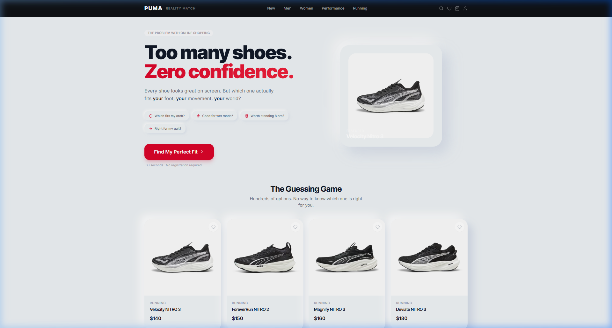
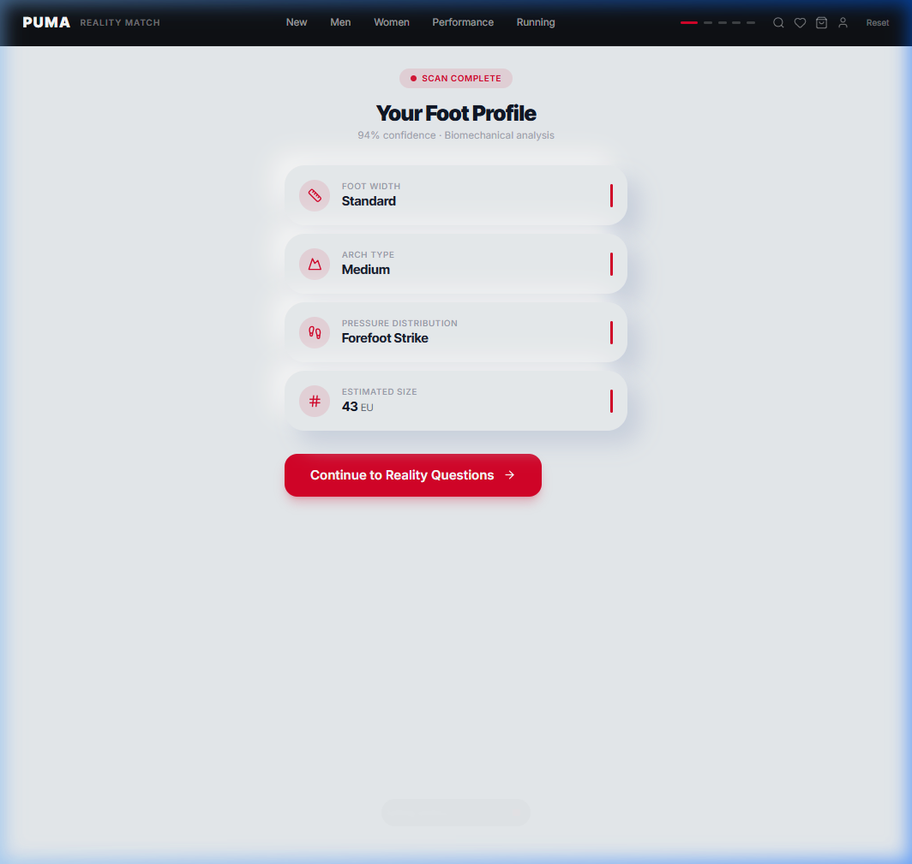
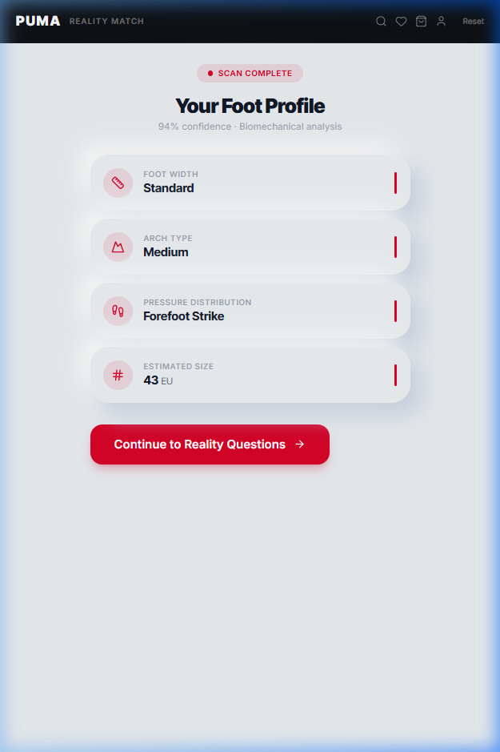
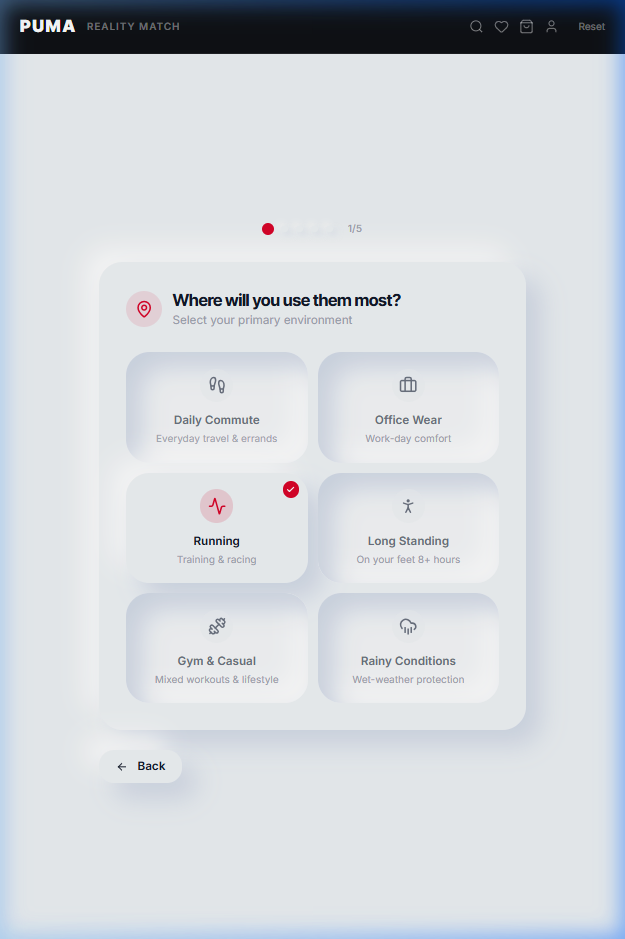
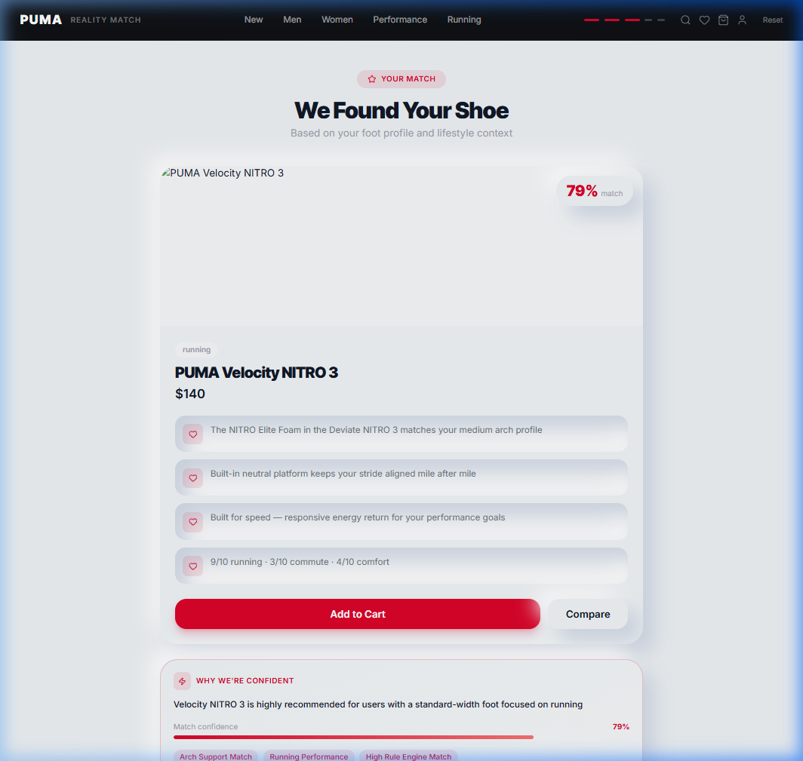
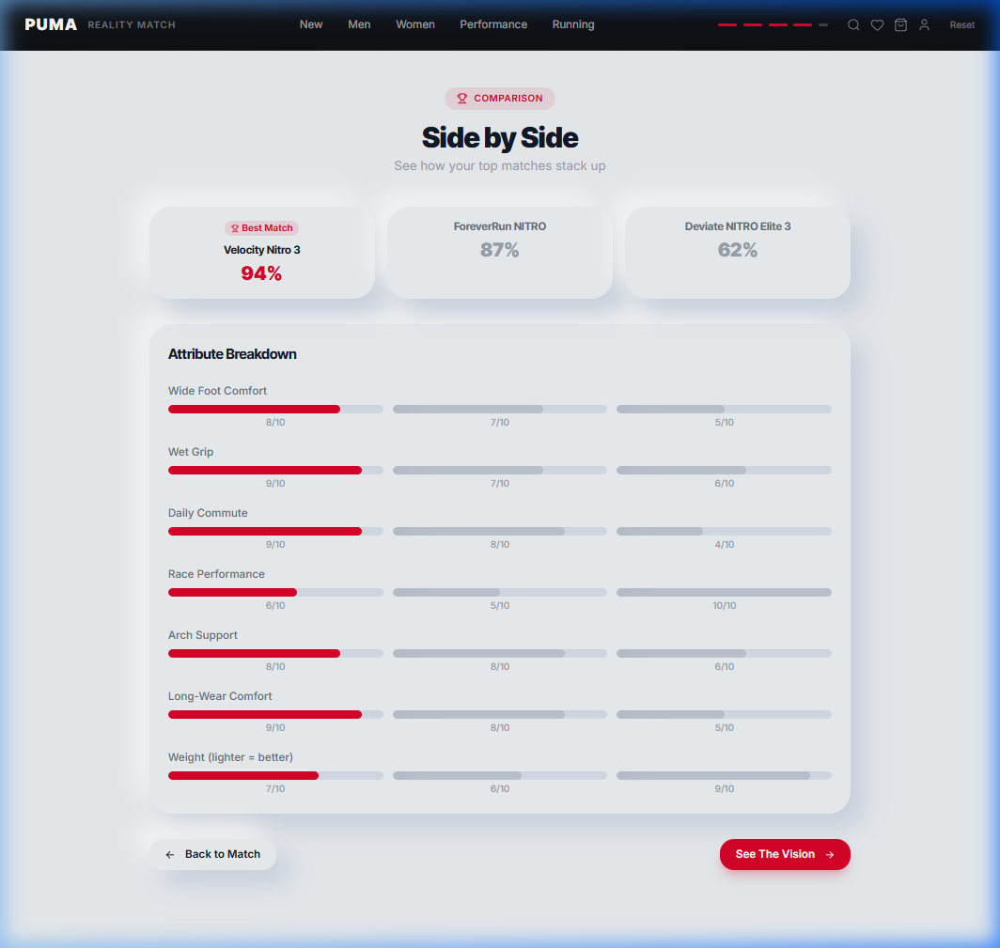
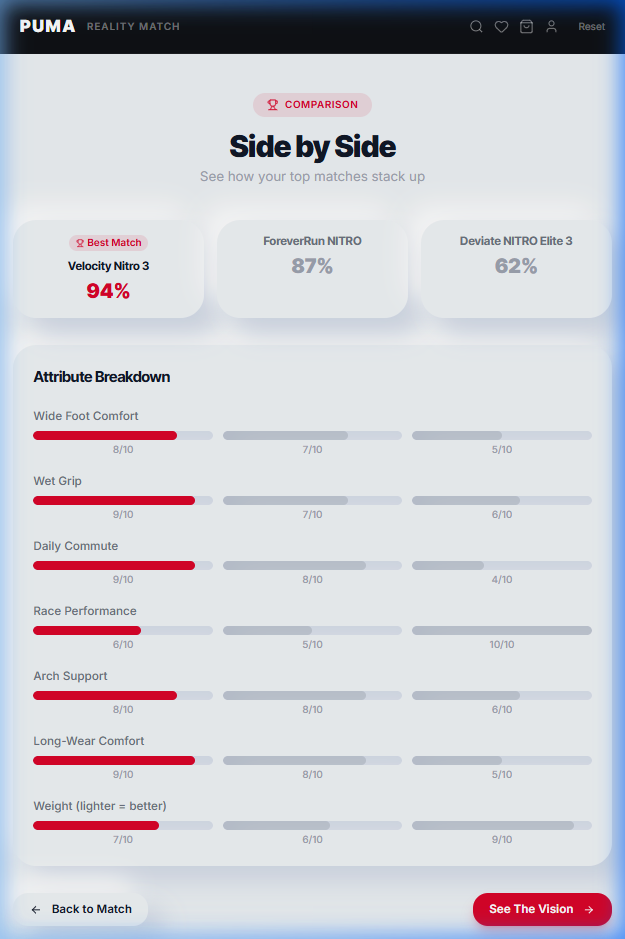
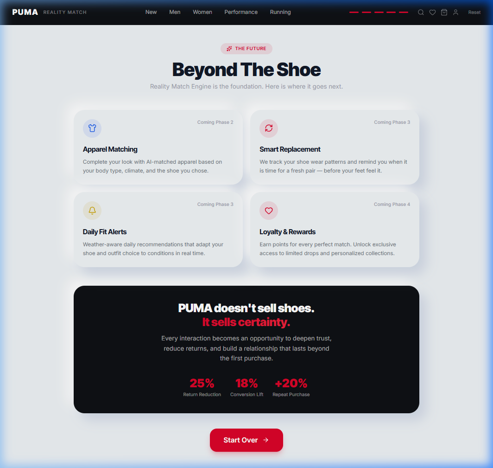

# PUMA Reality Match Engine



## Overview

The **PUMA Reality Match Engine** bridges the gap between online browsing and real-world fit. It represents a paradigm shift in footwear retail: moving away from generic size charts and aesthetic filtering, and toward **biomechanical compatibility** combined with **contextual intelligence**. 

Built to premium PUMA standards, the engine acts as an expert digital fitter, evaluating user physiology (width, arch, pronation) and use-case data (climate, activity, volume) against a rigorous metadata matrix of PUMA's footwear catalog. The result is a hyper-personalized, explainable shoe recommendation.

---

## Architectural Philosophy

The solution is engineered to be **Clean, Clear, and Scalable**, adhering to modern product architecture standards.

1. **Biomechanical & Contextual Layering** 
   Matches are computed via a dual-layered algorithm. A hard rule-engine first filters out biomechanical mismatches (e.g., neutral shoes for severe overpronators), followed by an ML-ready hybrid scoring system that ranks the remaining candidates based on contextual affinity (e.g., cushioning priority, climate).
   
2. **Explainability First**
   Recommendations are presented as "transparent box" decisions. Instead of a black-box percentage, the user sees exactly *why* a shoe was selected (e.g., "Ideal for wide feet", "High arch support") and *why* others were eliminated.

3. **Data Moat & ML Evolution**
   Every scan, interaction, and explicit feedback metric is ingested into our Supabase telemetry pipeline. This continuously enriches the "Data Moat," seamlessly flowing into normalized datasets that automatically retrain the feature-weight classification models to continuously improve match accuracy.

---

## Core Product Journey

The Reality Match Engine engages the user through a frictionless, beautifully animated 6-step flow.

### 1. The Current Problem & Introduction
The user is introduced to the Reality Match concept with premium branding, establishing immediate trust.


### 2. Foot Physiology Scan
Using computer vision (simulated in demo), the system captures the user's core foot measurements: arch type, width, and pronation. 

<div style="display:flex; gap: 10px;">
  
  
</div>

### 3. Contextual Intelligence
A highly responsive, progressive questionnaire captures the user's intent: Activity, Environment, Time-on-foot, and Comfort vs. Performance priorities.

<div style="display:flex; gap: 10px;">
  
</div>

### 4. Explainable Match Result
The engine presents the optimal shoe match. Critical to user trust, it exposes the "Why" behind the match, detailing the biomechanical alignments and contextual benefits.



### 5. Transparent Comparison
The user can compare the primary recommendation against runner-ups, viewing detailed attribute scores across weight, wet grip, and long-wear comfort.

<div style="display:flex; gap: 10px;">
  
  
</div>

### 6. PUMA Ecosystem Vision
The match extends beyond the shoe. The system seamlessly integrates apparel, tracking apps, and loyalty programs to create a unified PUMA ecosystem around the user's specific activity.



---

## Technical Stack

- **Frontend:** React 19, TypeScript, Vite, TailwindCSS
- **Animation & State:** Framer Motion (premium page transitions & micro-interactions), Zustand (atomic state management)
- **Backend Services:** Node.js, Express, TypeScript
- **Database & Telemetry:** Supabase (PostgreSQL) — handling interaction events, normalized ML datasets, and model version registries.
- **Machine Learning Roadmap:** Incremental evolution from TypeScript feature-weight classifiers to XGBoost gradient boosted trees.

---

## Local Development & Setup

### Prerequisites
- Node.js (v20+)
- Supabase Project (See backend setup)

### Frontend
```bash
cd puma-frontend
npm install
npm run dev
```
The frontend application will run on `http://localhost:5173`.

### Backend
1. Connect to Supabase using the migrations in `puma-backend/src/db/migrations`.
2. Configure `.env` with `SUPABASE_URL` and `SUPABASE_ANON_KEY`.
```bash
cd puma-backend
npm install
npm run dev
```
The API services will run on `http://localhost:3001`.

---

*Architected and developed as a premium digital experience for PUMA global.*
